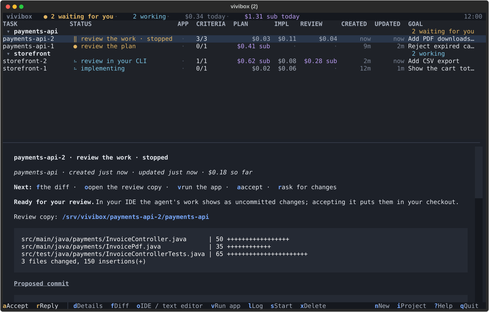

# vivibox

Coding agents in a box that keeps them off your machine, in both directions.

The agent works in its own pod: an unprivileged container with a Docker daemon of its own, so it can
run builds, Testcontainers and `docker compose` without your host's socket, your network or your
files. And nothing it writes runs on your machine until you have looked at it: it works on a clone,
its work comes back as a review copy, files that run code on IDE import need your approval, and a
gate it cannot bypass builds and tests its commits on a fresh clone before you accept anything.

You decide at checkpoints. The agent plans, you accept the plan, the agent implements, the gate
checks, you review and accept. Everything else runs on its own.



## Install

Linux with Docker Engine (tested on Ubuntu 24.04), and a model: an API key for any provider in
[opencode](https://opencode.ai)'s list, or an `opencode.json` you already have.

```bash
git clone https://github.com/DEVividious/vivibox.git && cd vivibox
host/setup.sh      # asks before each change: Sysbox, /srv/vivibox, uv, the vivibox command
vivibox            # builds the agent image, asks for a key and a model, opens the view
```

Details, and what `setup.sh` changes on your machine: [docs/install.md](docs/install.md).

**Bring your own models.** Import an `opencode.json` and every provider, model and MCP server in
it is set up for the agents: your employer's endpoint with its custom models, a local model, the
MCP servers you already use. Keys go to vivibox's own key store, never into config files.

## A task

1. `i` points vivibox at a repository; `n` describes a task, a line or a whole ticket.
2. The agent explores the repository and writes a plan with acceptance criteria. The task waits
   for you: `a` accepts the plan, `r` sends it back with a comment, `e` edits it.
3. The agent implements and commits in its clone, ticking the criteria as it goes.
4. The gate builds and tests the commits on a fresh clone, checks every criterion is ticked, the
   commit messages, and that no test was switched off. A red gate sends the agent back, up to a
   limit; then the task waits for you.
5. The work waits for you as a review copy: `o` opens it in your IDE as uncommitted changes,
   `v` runs the app in the pod, `a` accepts it into your checkout, `r` asks for changes.

Desktop notifications say when a task waits for you. Everything the view does is also a command
(`vivibox new`, `accept`, `reply`, `status`…), and planning can happen in your own chat instead of
on an API key. All of it: [docs/tasks.md](docs/tasks.md).

## More

- [What it protects against, and how](docs/security.md), with a comparison to Docker Sandboxes
- [Configuring providers, MCP servers and projects](docs/configure.md)
- [UX guidelines](docs/ux-guidelines.md), for anyone changing what the view says

Status: one agent per task through opencode. Planning can also run on Claude Code, or in your own
chat. Reviewer agents, GitHub and parallel tasks are next.

## Development

```bash
uv run ruff check . && uv run ruff format --check .
uv run pytest                  # unit tests, no Docker needed
uv run pytest -m docker        # isolation, pod and git protection checks on real containers
uv run python docs/img/screenshot.py   # redraws the picture above from made-up tasks
```

## License

MIT, see [LICENSE](LICENSE).
