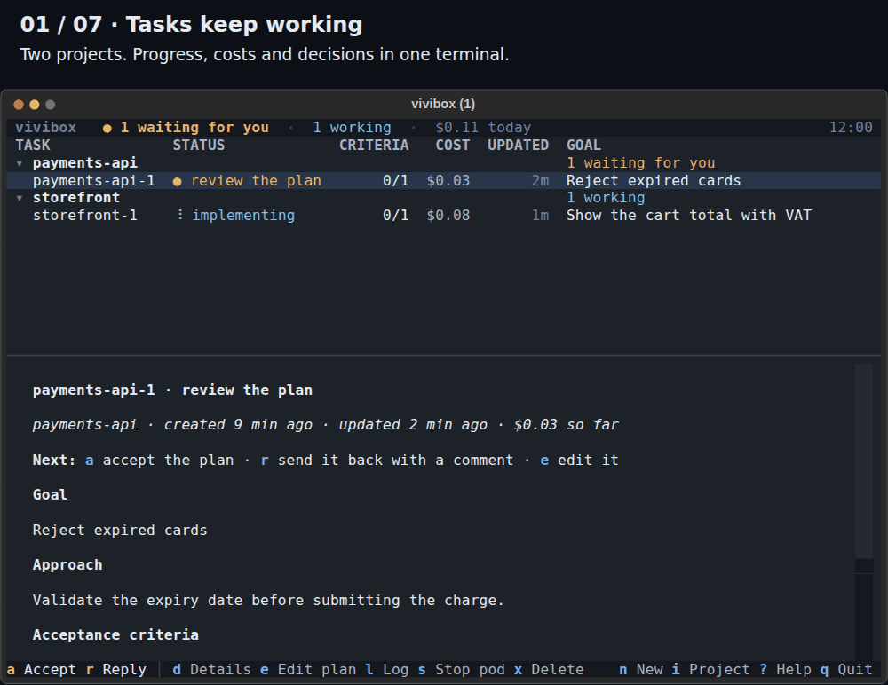

# vivibox

vivibox is a terminal orchestrator for coding agents: plan, implement, verify and review tasks
in isolated clones, then bring the work back for your approval.

Built for limited access to a strong model and plentiful access to smaller ones. Plan in your
existing chat subscription, then let API-backed models implement and review, with your project's
build and tests checking their work.



*27-second tour of the real TUI with fictional tasks, simulated progress and illustrative costs.*
[Still view](docs/img/view.svg) · [Quick start](#quick-start) · [Documentation](#documentation)

## Why vivibox

- **Choose where the strong model works.** Four flows share or separate agent sessions.
  Use a strong planner once, or keep it involved as the reviewer throughout the task.
- **Verify before independent review.** Build and test committed work on a fresh clone;
  check the accepted checklist, commits, disabled tests and recorded failing-test evidence.
  Failed checks and blocking review notes send the writer back for bounded fix rounds.
- **Give each task its own build environment.** An isolated **pod** holds the clone and its own
  Docker daemon for Testcontainers and Compose. Your host's Docker socket is never shared.
- **Leave tasks running; return for decisions.** One view tracks projects, tasks and reported
  costs. Background work continues with the view closed; desktop and ntfy notifications call
  you back. Inspect a review copy, request changes and decide what reaches your checkout.

## How it works

The default flow separates planning, writing and review:

```text
Planner → You approve → Writer → Gate → Reviewer → You review and accept
                          ↑       │       │
                          └───────┴───────┘
                           failed checks / blocking notes
```

**Gate** means mechanical verification. Every correction passes through it again before the
reviewer reads the work. The default is three fix rounds before you take over; your reply
renews that allowance. Changes to build files, hooks and IDE settings require separate
approval before the review copy opens.

### Choose a flow

Set **Flow** per task (`n`) or as a default (`k`). P = planner, W = writer, R = reviewer;
`+` shares one session and model. All four flows include verification.

| Flow | Sessions and verification | Best for |
|---|---|---|
| **Single agent** | P+W+R → Gate | Small, routine tasks |
| **Planner → Executor** | P → W+R → Gate | A strong plan with cheaper execution |
| **Planner → Writer → Reviewer** · default | P → W → Gate → R | Independent review with automatic fix rounds |
| **Supervisor ⇄ Worker** | P → W → Gate → P+R | Keeping the planning context through complex changes |

The first two self-review before verification. The default uses a separate reviewer container
and a fresh conversation each review; Supervisor ⇄ Worker reuses the planner's conversation
in the worker's pod. Both send blocking notes back through Writer → Gate → review.
[Flow and model details](docs/tasks.md#orchestration-modes).

## Quick start

**Alpha · Linux only.** The setup script targets Ubuntu on x86-64 (tested on 24.04).
Have Git, GitHub SSH access, Docker Engine accessible without sudo, and a model API key
(or a provider configuration to import).

```bash
git clone git@github.com:DEVividious/vivibox.git
cd vivibox
host/setup.sh
export PATH="$HOME/.local/bin:$PATH"
vivibox
```

Setup lists changes for confirmation: Sysbox, Docker network settings, host tools and task
storage. It may restart Docker. First launch builds the agent image and opens the view.
[Installation and uninstall](docs/install.md).

1. **Configure:** `k` → **Providers & MCP** → add a provider or import `opencode.json`.
2. **Create:** `i` adds your repository; `n` describes a task and selects its models. Choose
   a model for **Planner** to plan automatically; the initial default is **you, in your own chat**.
3. **Approve:** `d` shows the plan; `a` accepts it. If no verification command is configured,
   approve the writer's proposed command at a separate checkpoint.
4. **Review:** after verification and review, `f` shows the diff, `o` opens the review copy,
   `r` requests changes. `a` applies the work; a separate dialog offers a branch and commit message.

### Plan with your existing subscription

The **vivibox skill** lets Claude Code or Codex drive a task from your conversation. Use your
existing subscription to plan with a strong model; assign cheaper API-backed models to
implementation and review. Complete provider setup above first: those agents still need API access.

The `host/setup.sh` step above also installs or updates the skill for Claude Code and Codex
where they are already installed. No separate skill installation is needed. If you install
either CLI later, run `host/setup.sh` again. For a manual refresh of just the skill, use
`vivibox skill install`.

Open Claude Code or Codex in your project's repository and ask:

> Use the vivibox skill to add CSV export. Plan it with me, then hand implementation to vivibox.

In Claude Code you can also invoke `/vivibox`. The skill helps register the project, recommends
a compatible flow, creates the task and imports the plan you prepare together. It waits for
checkpoints, summarizes results and asks for your approval of the plan, risky changes and final
work. You can also follow the task in the TUI.

[Skill installation paths and CLI workflow](docs/tasks.md#driving-vivibox-from-an-agents-cli).

## Documentation

- [Providers, role models and project configuration](docs/configure.md)
- [Tasks, flows, CLI commands and logs](docs/tasks.md)
- [Isolation, verification and security boundaries](docs/security.md)
- [Development and reproducing the demo](CONTRIBUTING.md)

[Changelog](CHANGELOG.md) · [MIT license](LICENSE)
